# HoneyPot

HoneyPot is an e-commerce website that specialises in selling honey and honey by-products like beeswax. This website is perfect for people who want to invest into a healthier lifestyle and are looking for raw, unfiltered sweetners like our honey.

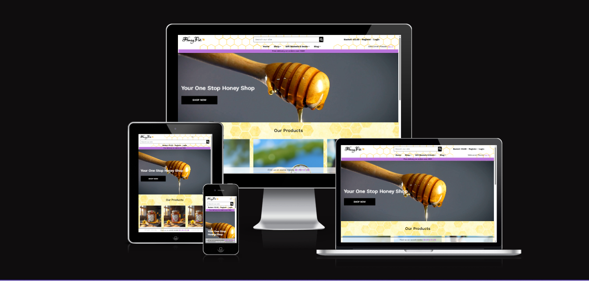

# Access the live site [here](https://honeypot-6aa199604c8f.herokuapp.com/)!

# Table of Contents

1. **[Project Goals](#project-goals)**
    * [Workflow](#workflow)
    * [Data Schema](#data-schema)
        + [Product Model](#product-model)
        + [ProductReview Model](#productreview-model)
        + [Category Model](#category-model)
        + [UserProfile Model](#userprofile-model)
        + [Order Model](#order-model)
        + [OrderItem Model](#orderitem-model)
        + [BlogPost Model](#blogpost-model)
        + [Comment Model](#comment-model)
        + [ProductCarousel Model](#productcarousel-model)
        + [Testimonial Model](#testimonial-model)
    * [Business Model](#business-model)
    * [Marketing Strategy](#marketing-strategy)
    * [Facebook Business Page](#facebook-business-page)
2. **[Target Audience](#target-audience)**
3. **[Design](#design)**
    * [The Five Planes of UX](#the-five-planes-of-ux)
        + [1. Strategy](#1-strategy)
        + [2. Scope](#2-scope)
        + [3. Structure](#3-structure)
        + [4. Skeleton](#4-skeleton)
        + [5. Surface](#5-surface)
    * [Wireframes](#wireframes)
        + [Home Page](#home-page)
        + [Product Page](#product-page)
        + [Product Detail Page](#product-detail-page)
        + [Profile Page](#profile-page)
        + [Shopping Bag Page](#shopping-bag-page)
        + [Checkout Page](#checkout-page)
        + [Blog Page](#blog-page)
    * [Typography](#typography)
    * [Color Scheme](#color-scheme)
4. **[Features](#features)**
    * [Existing Features](#existing-features)
        + [Navbar](#navbar)
        + [Home Page](#home-page)
            * [Products Carousel](#products-carousel)
            * [Testimonials](#testimonials)
            * [Newsletter](#newsletter)
        + [User Profile](#user-profile)
            * [My Profile](#my-profile)
            * [Edit Profile](#edit-profile)
            * [Change Password](#change-password)
            * [Delete Account](#delete-account)
        + [User Authentication](#user-authentication)
            * [Sign Up Page](#sign-up-page)
            * [Confirm Email Page](#confirm-email-page)
            * [Sign In Page](#sign-in-page)
            * [Reset Password](#reset-password)
        + [Products Page](#products-page)
            * [Product List](#product-list)
            * [Searching & Filtering](#searching--filtering)
            * [Product Details](#product-details)
            * [Reviews & Ratings](#reviews--ratings)
            * [Related Products](#related-products)
        + [Shopping Bag](#shopping-bag)
        + [Checkout](#checkout)
            * [Successful Checkout](#successful-checkout)
        + [Blog Posts](#blog-posts)
            * [Recipes](#recipes)
            * [Comments](#comments)
        + [Admin Management](#admin-management)
            * [Product Management](#product-management)
            * [Reviews Management](#reviews-management)
            * [Orders Management](#order-management)
            * [Comments Management](#comments-management)
    * [Future Implementations](#future-implementations)
5. **[Technologies](#technologies)**
6. **[Deployment and Local Development](#deployment-and-local-development)**
    * [Create a Database](#create-a-database)
    * [Django Project Settings](#django-project-settings)
    * [Heroku Deployment](#deployment)
    * [Local Development](#local-development)
7. **[Testing](#testing)**
    * [Validation](#validation)
        + [Form Validation](#form-validation)
        + [W3C Validator](#w3c-validator)
        + [Jigsaw CSS Validator](#jigsaw-css-validator)
        + [JS Hint](#jshint)
        + [PEP8](#pep8)
        + [Wave Accessibility](#wave-accessibility)
        + [Lighthouse Report](#lighthouse-report)
    * [Manual Testing](#manual-testing)
    * [Fixed Bugs](#fixed-bugs)
8. **[Credits](#credits)**
    * [Code Used](#code-used)
    * [Content](#content)
        + [Icons](#icons)
        + [Images](#images)
9. **[Acknowledgements](#acknowledgements)**

# Project Goals

The main goal for this website is to offer ethically sourced, organic and healthy honey to potential customers, especially in this day and age when a lot of people are trying to be lead healthier lifestyles, but don't always know where to look for it. The website makes it easy for the user to find the product desired, add it to cart and purchase it. It is intuitive to navigate, with a seamless UX, designed in a simple, themed website.

## Workflow

This project was planned using the Agile Methodology. Features were grouped into **EPICS** (*Milestones* on `Github`), which in turn contain **USER STORIES** (*Issues* on `Github`), which also contained *Tasks* and *Acceptance Criteria* to ensure the features were implemented most efficiently.

The project Kanban can be seen [here](https://github.com/users/petra66orii/projects/3)

Users can do the following:

* Browse Products: [EPIC: Product Details](https://github.com/petra66orii/honeypot/milestone/2)
* Review Products: [EPIC: Product Reviews](https://github.com/petra66orii/honeypot/milestone/3)
* Purchase Products: [EPIC: Checkout](https://github.com/petra66orii/honeypot/milestone/5)

## Data Schema 

Planning for the database involved creating an ERD to see the relationships between the data models. Models have changed and evolved over the course of this project, so here is the initial ERD image:

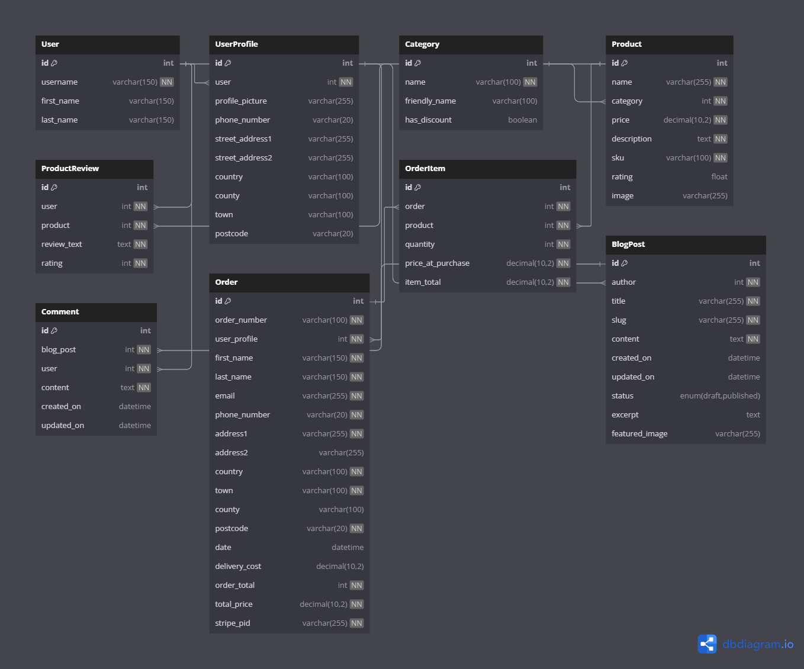

And here is the final version of the ERD:

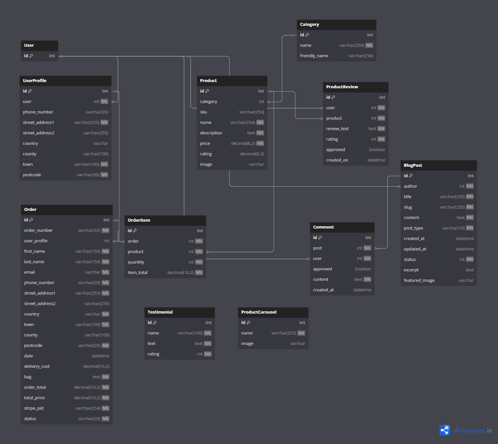

The application uses a relational database to store and manage data. Below is the data schema:

### Product Model

**Fields**:

* `name`: CharField (max_length=255) - Name of the Product
* `category`: *ForeignKey* to the *Category* model - *Relation*: 
* `price`: DecimalField (max_digits=10) - Price of the product
* `description`: TextField - Description of product
* `sku`: CharField (max_length=100) - Unique indentifier of the product
* `rating`: FloatField (default=0.0) - Average rating of the product
* `image`: ImageField - Picture of the product

### ProductReview Model

**Fields**:

* `user`: *ForeignKey* to the *User* model - *Relation*:
* `product`: *ForeignKey* to the *Product* model - *Relation*:
* `review_text`: TextField - The content of the review
* `rating`: FloatField - Rating of the product
* `approved`: BooleanField - Whether the review is approved or not
* `created_on`: DateTimeField - Date of creation

### Category Model

**Fields**:

* `name`: CharField (max_length=100) - Name of the category in the Admin panel
* `friendly_name`: CharField (max_length=100) - Category name displayed in the website
 
### UserProfile Model

**Fields**:

* `user`: *OneToOneField* to the *User* model (*Relation*: One user has one profile)
* `phone_number`: CharField (max_length=20) - User's phone number
* `street_address1`: CharField (max_length=255) - First line of the address
* `street_address2`: CharField (max_length=255) - Second (optional) line of the address
* `country`: CharField (max_length=100) - User's country of residence
* `county`: CharField (max_length=100) - User's county of residence
* `town`: CharField (max_length=100) - User's town/city of residence
* `postcode`: CharField (max_length=20) - User's postcode

### Order Model

**Fields**:

* `order_number`: CharField (max_length=100) - Unique number order
* `user_profile`: *ForeignKey* to the *UserProfile* model
* `first_name`: CharField (max_length=150) - User's first name
* `last_name`: CharField (max_length=150) - User's last name
* `email`: EmailField - User's email address
* `phone_number`: CharField (max_length=20) - User's phone number
* `street_address1`: CharField (max_length=255) - First line of the address
* `street_address2`: CharField (max_length=255) - Second (optional) line of the address
* `country`: CharField (max_length=100) - User's country of residence
* `town`: CharField (max_length=100) - User's town/city of residence
* `county`: CharField (max_length=100) - User's county of residence
* `postcode`: CharField (max_length=20) - User's postcode
* `date`: DateTimeField - Date of purchase
* `delivery_cost`: DecimalField (max_digits=10) - Cost of delivery
* `bag`: TextField - Contents of the bag
* `order_total`: IntegerField - Total number of products ordered
* `total_price`: DecimalField(max_digits=10) - Total price of the order
* `stripe_pid`: CharField (max_length=255) - Unique client secret for Stripe API
* `status`: CharField (max_length=20) - Whether the order has been fulfilled or not

### OrderItem Model

**Fields**:

* `order`: *ForeignKey* to the *Order* model
* `product`: *ForeignKey* to the *Product* model
* `quantity`: IntegerField - Quantity of the item bought
* `item_total`: DecimalField (max_digits=10) - Total price of the product

### BlogPost Model

**Fields**:

* `author`: *ForeignKey* to the *User* model
* `title`: CharField (max_length=255) - Title of the blog post
* `slug`: SlugField - Blog post's slug
* `content`: TextField - Content of the post
* `post_type`: CharField (max_length=10) - Whether the post is a regular blog post or recipe
* `created_at`: DateTimeField - Date of creation
* `updated_at`: DateTimeField - Date of update (if any)
* `status`: CharField (max_length=10) - Whether the post is a draft or published
* `excerpt`: TextField - A short excerpt of the post
* `featured_image`: ImageField - Feautred image (optional)

### Comment Model

**Fields**:

* `blog_post`: *ForeignKey* to the *BlogPost* model
* `user`: *ForeignKey* to the *User* model
* `approved`: BooleanField - Whether the comment is approved or not
* `content`: TextField - Content of comments
* `created_on`: DateTimeField - Date of comment posted

### ProductCarousel Model

* `name`: CharField (max_length=255) - Name of the product
* `image`: ImageField - The product's image

### Testimonial Model

* name: CharField (max_length=100) - The author's name
* text: TextField - The content of the testimonial
* rating: PositiveIntegerField (default=5) - Rating included in the testimonial

## Business Model

HoneyPot offers high-quality, ethically sourced honey and bee-related products. Its unique selling points include organic, raw, and locally sourced honey, along with infused varieties. Customers enjoy a seamless e-commerce experience with an easy checkout experience and fast shipping. Also, a blog provides valuable content on honey’s benefits, beekeeping, and recipes.

Revenue comes from direct product sales, bundled gift sets, bulk orders for businesses, and affiliate partnerships with influencers in the food, health, and sustainability niches.

Costs include sourcing honey (either from local beekeepers or in-house production), website maintenance, payment processing fees, marketing expenses, and shipping/packaging. Key partnerships involve local suppliers, eco-friendly packaging providers, shipping companies, and content creators who promote the brand.

## Marketing Strategy

The brand focuses on purity, sustainability, and ethical sourcing. A compelling story (such as "Supporting Local Beekeepers" or "Raw & Unfiltered Honey") helps differentiate it. The website has a minimal, clean design with high-quality product images.

SEO and content marketing play a big role, with optimized product pages targeting searches like "raw honey online" and "best organic honey." The blog covers topics like honey’s health benefits, DIY recipes, and beekeeping sustainability. Video content (shorts, reels) showcases tutorials and product highlights.

Social media efforts focus on Instagram and Pinterest for aesthetic product photography, TikTok and YouTube Shorts for quick recipes, and partnerships with food bloggers and wellness influencers. Giveaways help boost engagement.

Email marketing includes newsletters with exclusive discounts, first-time purchase incentives, and a loyalty program rewarding repeat buyers. Paid ads on Google and social media target keywords and retarget visitors who abandoned their shopping carts.

## Facebook Business Page

The Facebook page is optimized with a high-quality logo, engaging cover image, and a compelling About section. A Shop Now button links to the website, and Messenger is set up for customer inquiries.


Content includes educational posts on honey’s benefits, product highlights, behind-the-scenes production stories, customer testimonials, live Q&As, and seasonal promotions. The brand engages with relevant Facebook groups and creates a community where customers share recipes and reviews.

# Target Audience

HoneyPot sells raw, unfiltered honey infused with different ingredients (whilst also selling the *classical* honey) at a more affordable price than most honey retailers. Our target audience is large, addressing to people looking for organic products, young families that want to offer their children healthy desserts, people that want a healthier lifestyle, or that just want to replace sugar.

# Design

## The Five Planes of UX

The five planes of UX — *Strategy*, *Scope*, *Structure*, *Skeleton*, and *Surface* — offer a structured approach to crafting a seamless and engaging user experience. These principles shape the design of the e-commerce honey website.

### 1. Strategy

The website’s purpose is to provide customers with high-quality honey and bee-related products while fostering brand trust and educating users about honey’s benefits.

**User Needs**:

* A seamless shopping experience with clear product categories and easy checkout.
* Informative content about honey, including health benefits, sustainability, and recipes.
* Customer reviews and ratings to help with purchasing decisions.

**Business Goals**:

* Increase product sales through a well-optimized and conversion-driven design.
* Build a strong brand identity and customer loyalty with engaging content and a smooth shopping experience.
* Differentiate from competitors by emphasizing sustainability, ethical sourcing, and product quality.

### 2. Scope

The website includes key e-commerce and content-driven features:

**Product Catalog & Shopping Experience**:

* Browse products by category, type, and price range.
* Add items to cart and complete a secure checkout using Stripe.
* View product descriptions, ingredients, and customer reviews.

**User Engagement & Content**:

* *Blog*: Articles on honey’s benefits, recipes, and sustainable beekeeping.
* *Product Reviews*: Customers can leave ratings and feedback to guide other buyers.
* *Email Newsletter*: Users can sign up for updates, promotions, and exclusive offers.

**Marketing & Retention**:

* Discount codes and promotional offers.
* Loyalty rewards for repeat customers.
* Social media integration for sharing and engagement.

### 3. Structure

**Content Hierarchy**:

* *Primary Navigation*: Home, Shop, Blog, About Us, Contact.
* *Secondary Navigation*: Account, Cart, Order History, FAQs.

**User Flows**:

*For purchasing a product*:

* Browse products by category or use filters.
* Select an item, read the description and reviews.
* Add to cart and proceed to checkout.
* Enter payment and shipping details, complete the order.
* Receive confirmation and tracking updates.

*For reading the blog*:

* Browse articles by category (e.g., health benefits, recipes).
* Read content and explore related posts.
* Share or comment on blog posts.

### 4. Skeleton

**Navigation Design**:

* A fixed top navigation bar with dropdown menus for quick access.
* A search bar for finding products and blog content easily.

**Interface Elements**:

* *Forms*: Simple, clean checkout and review submission forms.
* *Product Cards*: Feature images, price, rating, and a quick “Add to Cart” button.
* *Call-to-Action (CTA) Buttons*: Prominent "Buy Now," "Read More," and "Subscribe" buttons.

**Feedback & Progress Indicators**:

* Visual confirmation for actions like “Item added to cart” or “Order placed.”
* Checkout progress bar to guide users through the purchase process.

**Responsive Design**:

* Mobile-first approach to ensure smooth shopping on all devices.

### 5. Surface

**Design Style**:

* *Theme*: A warm, natural aesthetic that reflects purity and sustainability.
* High-quality images of honey, bees, and nature to enhance visual appeal.

**Typography**:

* A clean, modern sans-serif font for readability, paired with a handwritten or organic-style font for branding elements.

**Imagery & Emotional Impact**:

* High-resolution product images showcasing texture and packaging details.
* Lifestyle shots of honey being used in recipes or natural settings to reinforce authenticity.
* Creates a sense of warmth, tradition, and natural goodness, encouraging users to connect with the brand and its values.

## Wireframes

For establishing the UX design, wireframes were designed using Balsamiq:

### Home Page


### Product Page


### Product Detail Page

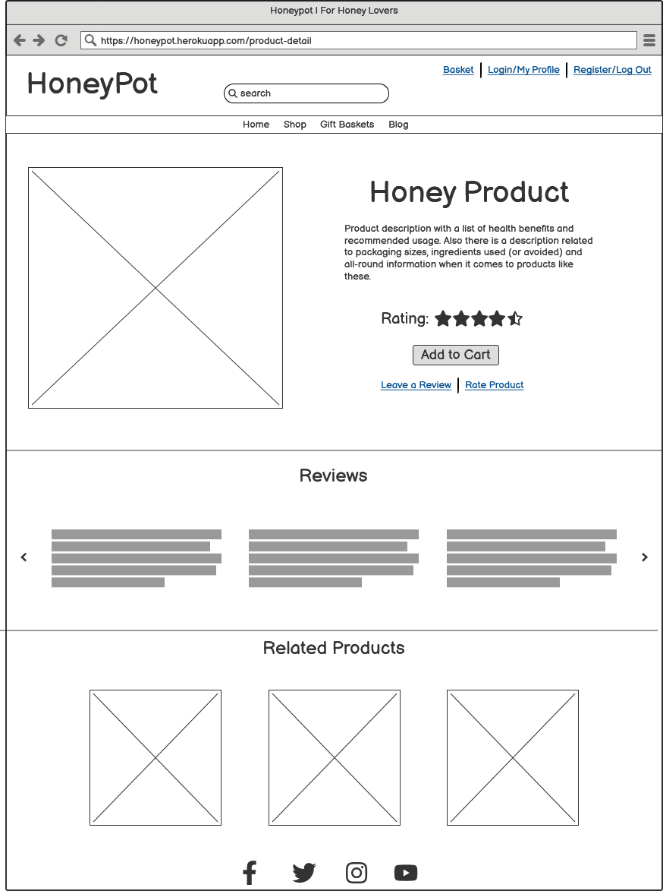

### Profile Page

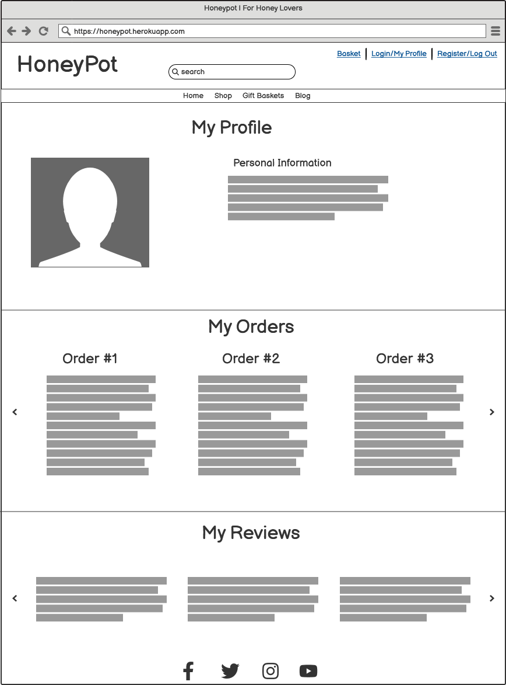

### Shopping Bag Page

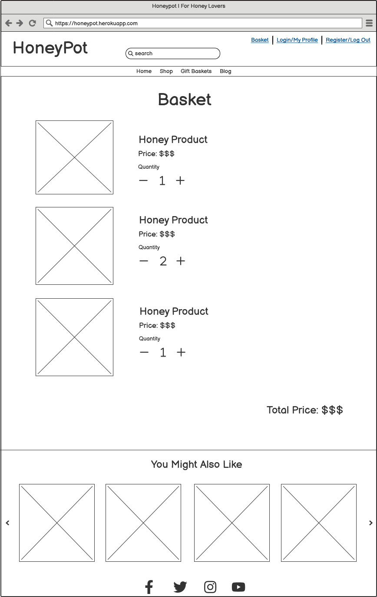

### Checkout Page

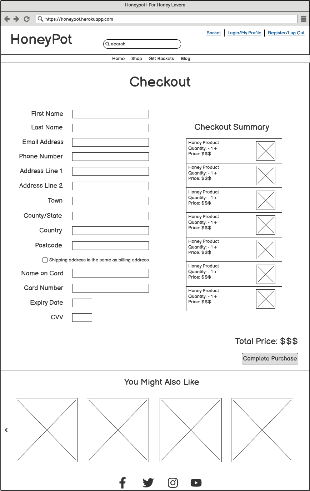

### Blog Page


## Typography

For the logo I went for the *"Lavishly Yours"* font, because it inspired elegance to me and it felt like an appropriate font for a compelling logo. 

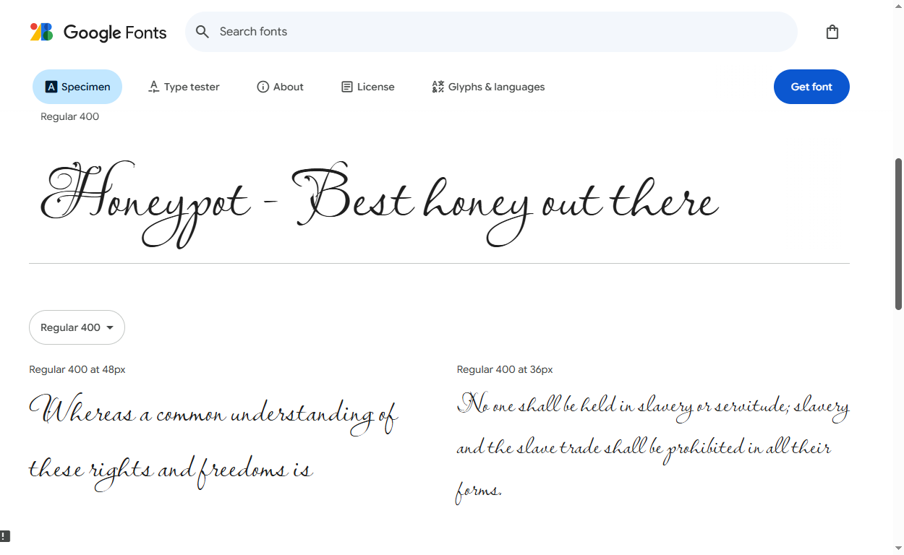

For the rest of the website I used *"Work Sans"* for its readablity.

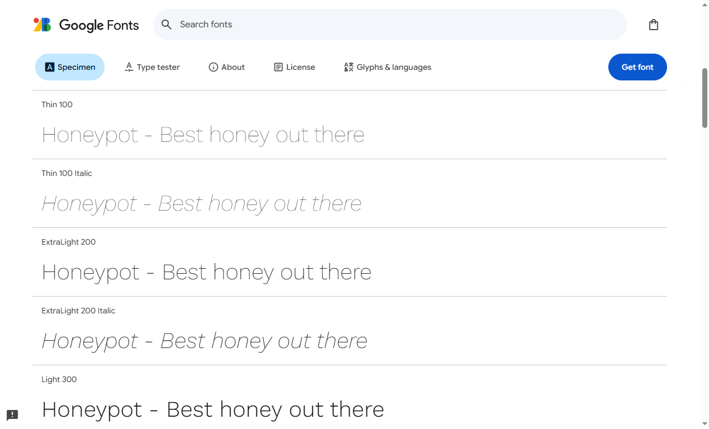

## Color Scheme

Since it's an e-commerce website that sells honey, the color scheme is fairly simple, containing black and white to keep it classic, and added yellow-gold - to match the honey, and lavender - for a pop of color, in order to bring a nice aesthethic to the website.

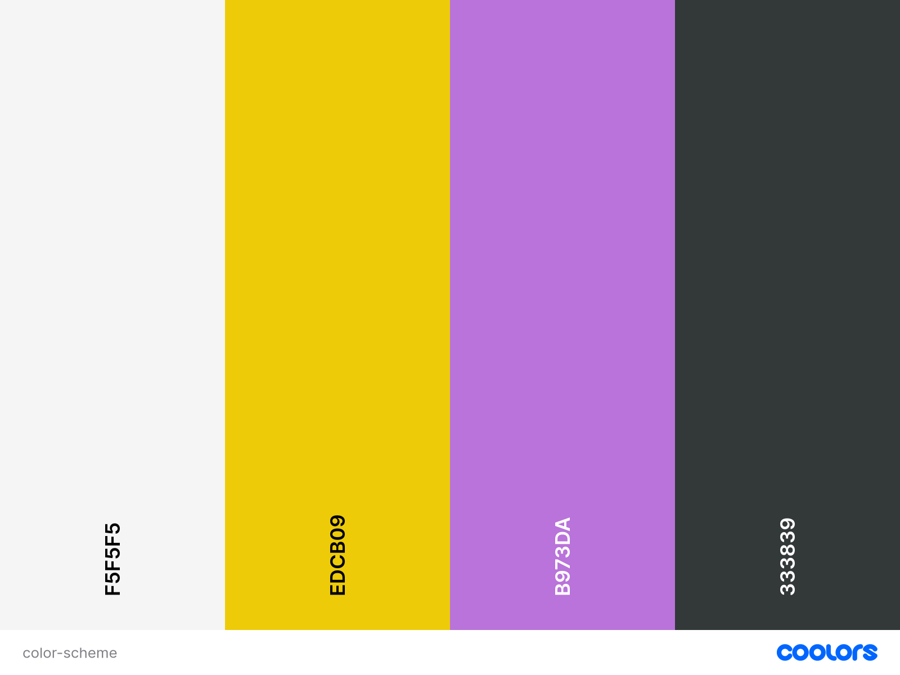

# Features

There are multiple features in this website, and there are plenty of future developments available for this website as well.

## Existing Features

### Navbar

The navbar has a lot of options for users:

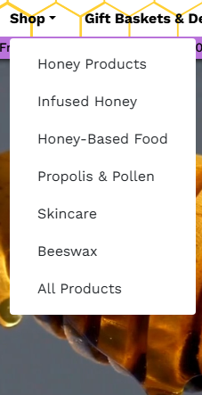
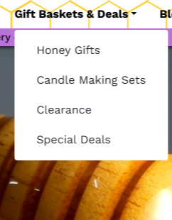
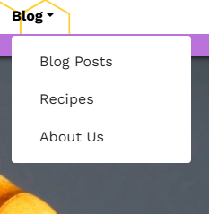

Navbar changes its options depending on user's level of access:

1. User not logged in:
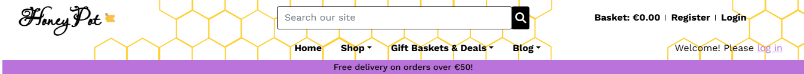

2. User logged in:
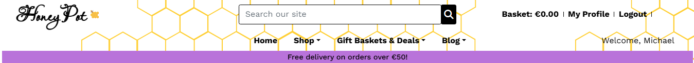

3. Admin logged in:
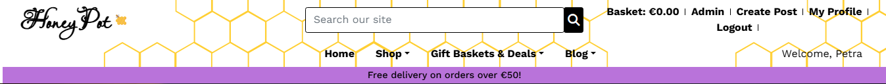

The navbar is also responsive:

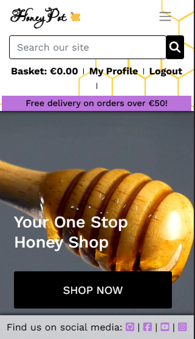
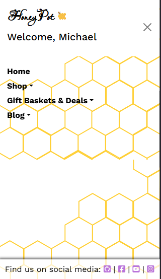

### Home Page

The home page is Honeypot's calling card: the honey dripping video is meant to invoke a pleasant feeling and induce craving for honey. The user has the option to go straight to the Products section by clicking on the "Shop Now" button, or they can scroll down to see a carousel of products, where they can see a selection of products being displayed. 


Below the products, the users can sign up for the store's newsletter to receive more updates. Scrolling further down, the user can see a selection of positve testimonials from previous customers, praising the products and their quality. Both of these carousels are responsive.

#### Products Carousel

The Products carousel offers a selection of products that changes automatically, but also allows the user to scroll at their own pace. Below the carousel, a button "Check our products" redirects the user to the "Products" page. 

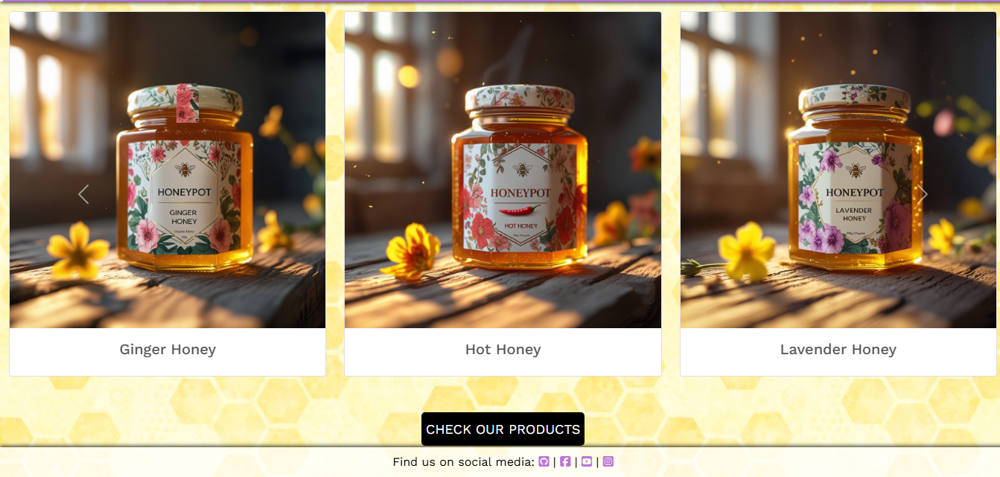

#### Testimonials

The Testimonials carousel offers a selection of testimonials from happy customers that praise the products they've bought and their quality. The testimonial displays their name, rating and their review. The carousel is changing automatically, providing a pleasant UX.

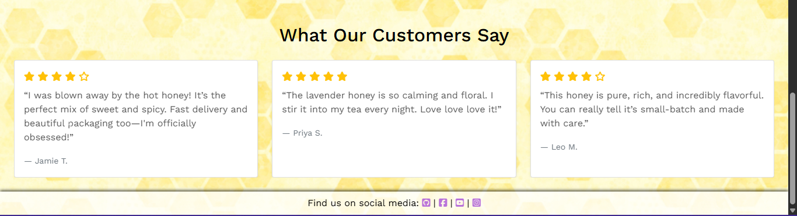

#### Newsletter

The newsletter is positioned between the two carousels, so that the user can see the appealing products above the newsletter, whilst the testimonials underneath provide reliable feedback, prompting the user to sign up for this newsletter. The newsletter was set up using MailChimp's embedded code.

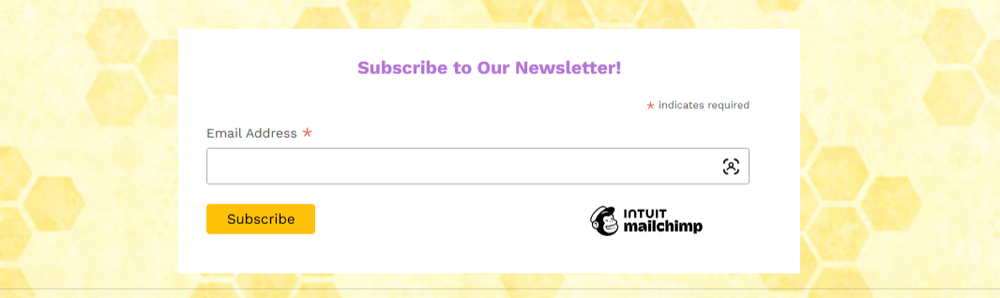

### User Profile

On sign up, a profile is automatically created for users. On the left side of the profile, they have multiple options within their profile, such as editing their delivery infromation, editing their account details, changing their password, and even deleting their account should they desire to do so. On the right side of their profile, there is a section displaying their order history, where they can access their previous orders by clicking on the order number (*See [Checkout](#checkout) section for more information*).

#### My Profile

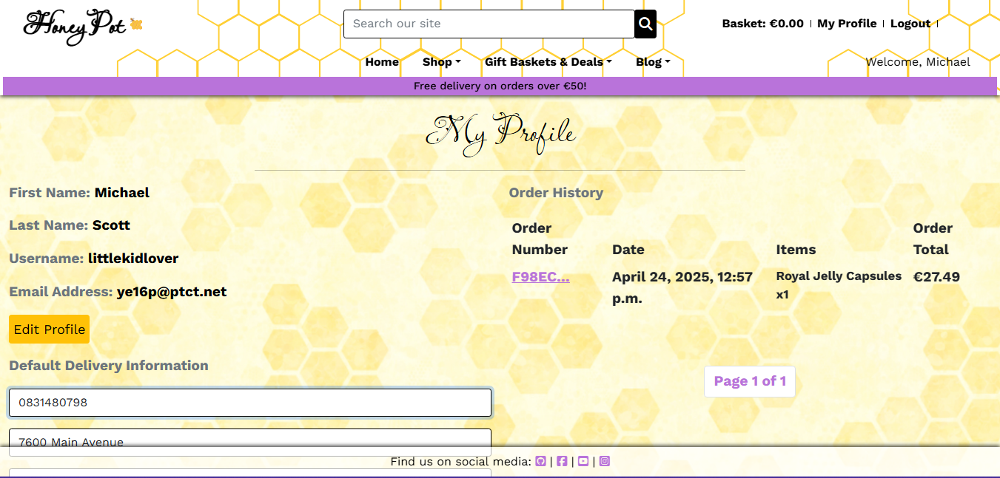

At the top of the profile page, the user sees their details like full name, username, and email address (*Note: Did you spot the reference from "The Office"?*). Under these details, the button "Edit Profile" allows the user to make any changes they wish to any of their details. 

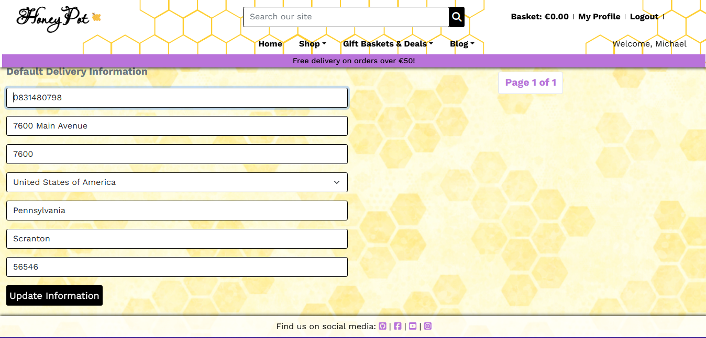

More profile information is provided underneath in the shape of a form where the user can update their delivery information like street address, county, town (or city), postcode and more. When the user makes an order (while logged in), their delivery information is automatically updated and displayed in their profile and available for future use.

#### Edit Profile

This page gives the user the opportunity to change their sign-in information like username and email address. Underneath this form, the button "Change Password" and "Delete Profile" are displayed.

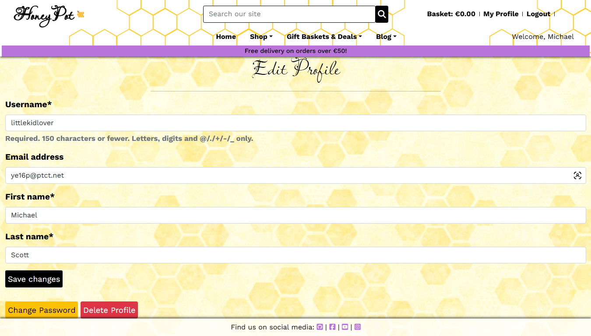

#### Change Password

This page enables the user to change their password. They're required to enter their old password, and then their new password twice to confirm it. If the user doesn't remember their old password, they have the option to click on the "Forgot Password?" link, which redirects them to the page where they can reset their password.

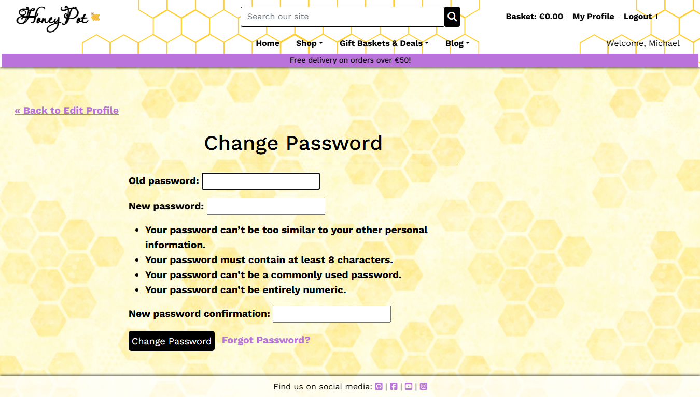

#### Delete Account

If the user desires to do so, they can opt to delete their account altogther. This change is permanent and irreversible, and the user is let known before making this decision. They're asked to confirm this action, so that if the user accidentally clicks on the button, they can safely cancel it.

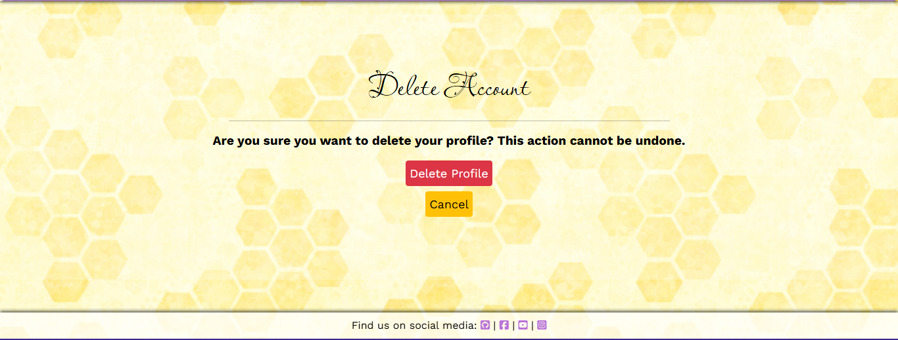

### User Authentication

While orders can be made as guests as well, the user is highly recommended to create an account so that their information can be saved in their profile for future use. Also, if they sign up, they can check their user history, whilst they can't do that as guest users.

#### Sign Up Page

The sign up page requires the user to input their full name, username, email address and password. The form is validated and the user is given information regarding the strength of their password.

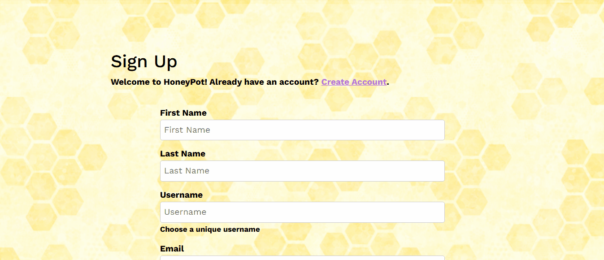

#### Confirm Email Page

After signing up, the user is required to verify their email address.

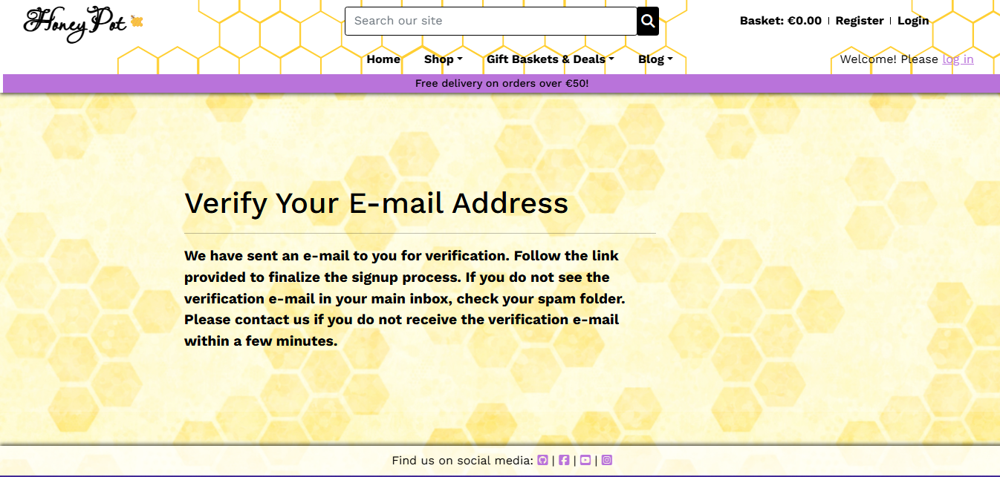

An email is automatically sent to the user's email address where a link redirects them to another page, requesting users to confirm their email address. After doing so, the user is redirected to the Sign In page.

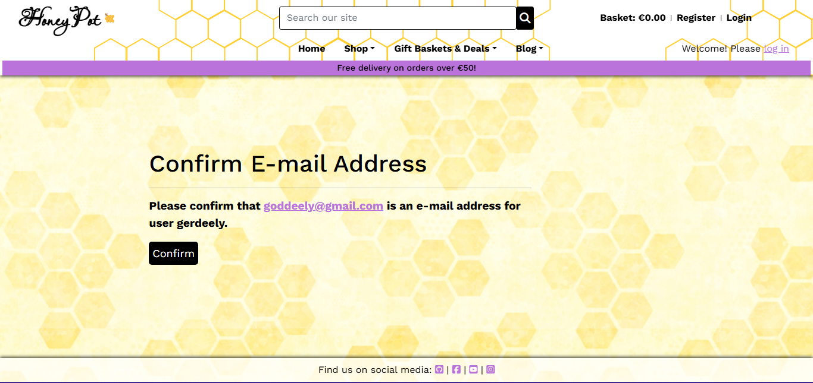

#### Sign In Page

This the user sign in page. They can sign in with their username or by using their email address. If the user doesn't remember their password, they can click on the "Forgot Password?" link. 

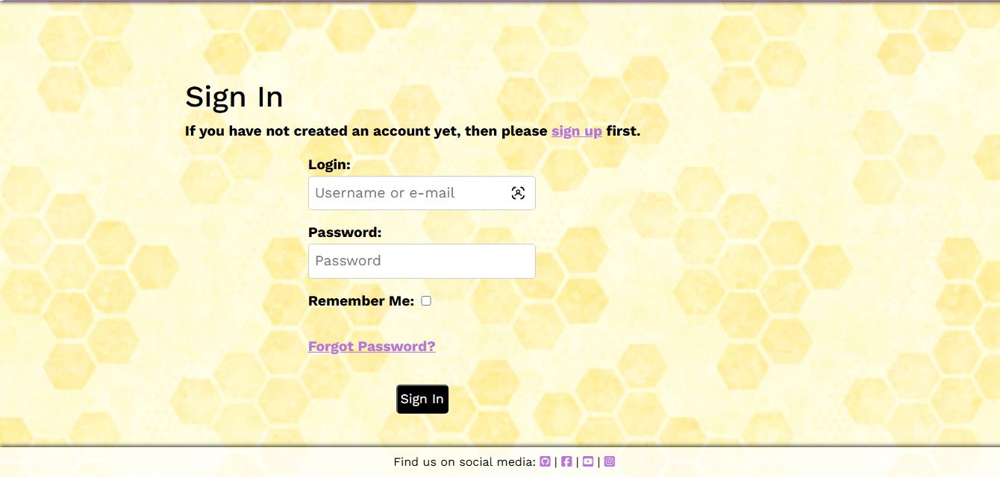

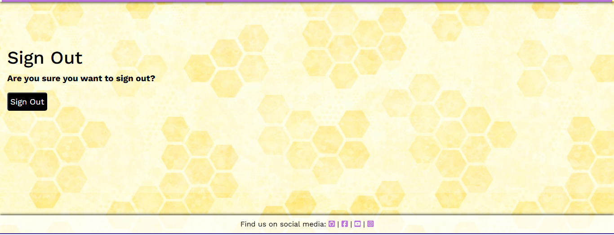

#### Reset Password

When redirected to this page, the user is required to input their email address. After this, the user receives a link that redirects them to a page where they can input their new password and confirm it. 

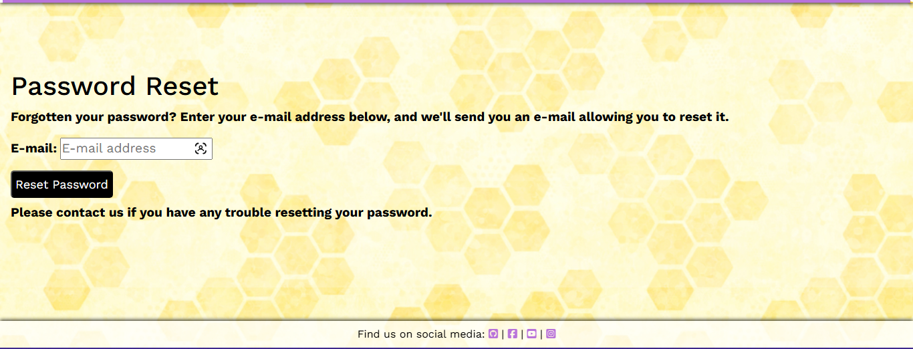

### Products Page

The Products page contains all of the products listed, each product having a name, rating (if applicable), their image, and a "Buy Now" button. User can click on either the name of the product or the image to be redirected to the product detail page. 

If the user clicks on the "Buy Now" button, the product is added to cart and the user is immediately redirected to the checkout page.


#### Product List

Products are listed and paginated, the user can easily navigate throughout the products, and there is a "Sort" option at the top of the page, where the user can sort products depending on price, rating or category.

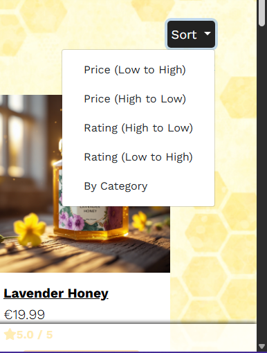

#### Searching & Filtering 

User can filter the products as well by selecting one of the options in dropdown menus "Shop" and/or "Gift Baskets & Deals" located in the navbar (*See [Navbar](#navbar)*). If they want to look up a particular product, they can look it up by typing the name in the search bar:

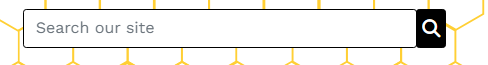

#### Product Details

The user can see details regarding the product, such as a description, the price and the average rating, alongisde an option to add to basket with the possibility to choose the quantity.

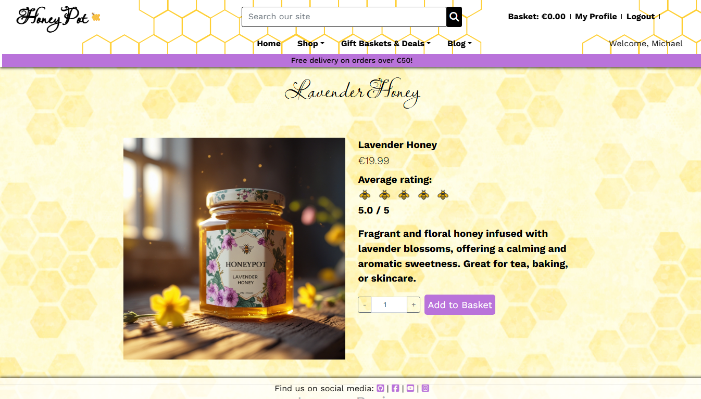

#### Reviews & Ratings

Underneath the product details, user can see the reviews and ratings of the product. In order to leave a review, the user has to first be logged in. They can leave a rating without a review, but they can't leave a review without rating the product.

Once a review is submitted, the user receives a feedback message letting them know that the review is submitted and awaiting approval.

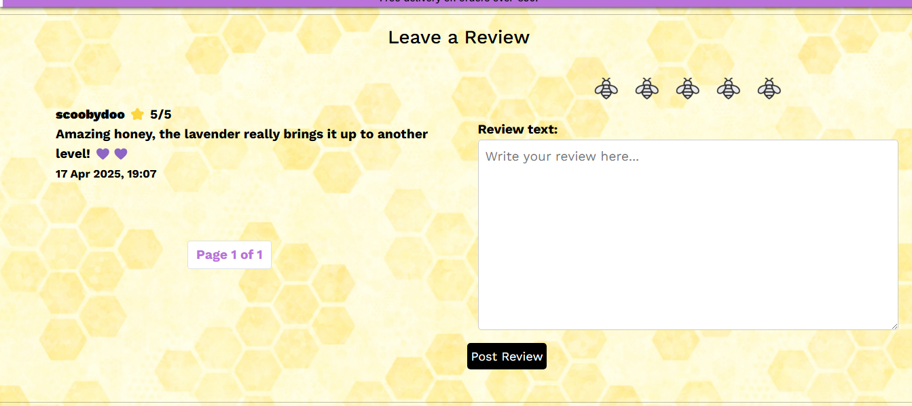

After the review has been approved by the store owner, users can edit and/or delete their own reviews if they want.

The rating feature is interactive, and instead of classical stars, it contains bees. In its initial state, the bees are grey, indicating no rating:


When hovering over a number of bees, the bees are colored and sparkle:


When the user clicks on the bees, the bees are colored and stay like this:


#### Related Products

Under the reviews section, users can see products related to the product they are currently viewing.

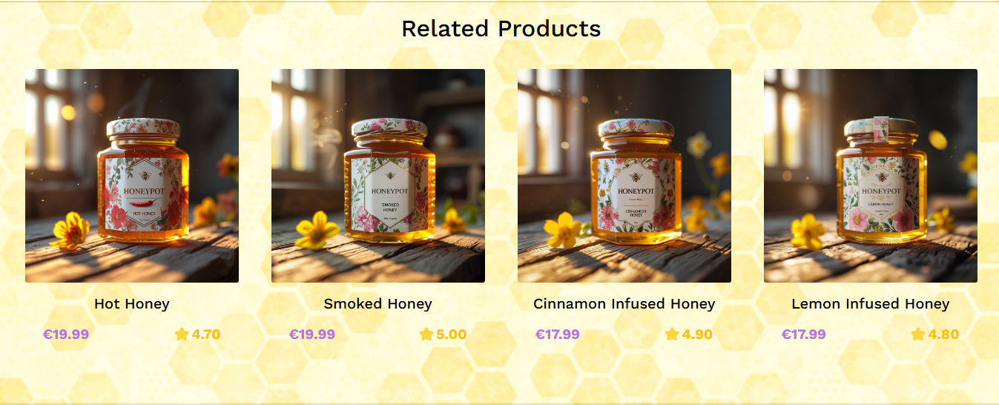

### Shopping Bag

The shopping bag feature displays the user's basket. They can choose to update their basket adding or subtracting the quantity of the desired product, or even remove the product altogether if they don't want it anymore.

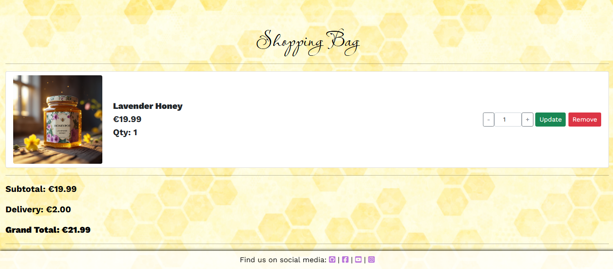

#### "You Might Also Like"

Before the "Checkout" button, users come across a section called "You Might Also Like", where related products are displayed, with a small discount in order to persuade the user into purchasing more products before checkout.

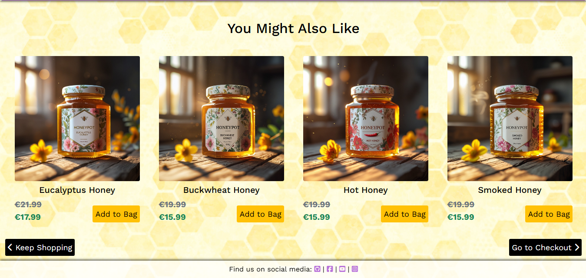

### Checkout

The checkout has the user's information on the left side (if it's the first order and the user didn't fill in their details in their profile page, the form is empty), and on the right side they get a summary of their products plus the payment section. The user still has the option to update the bag from the checkout page. Once they've filled up the delivery information and payment details, the user receives a confirmation email and is redirected to the successful checkout page.

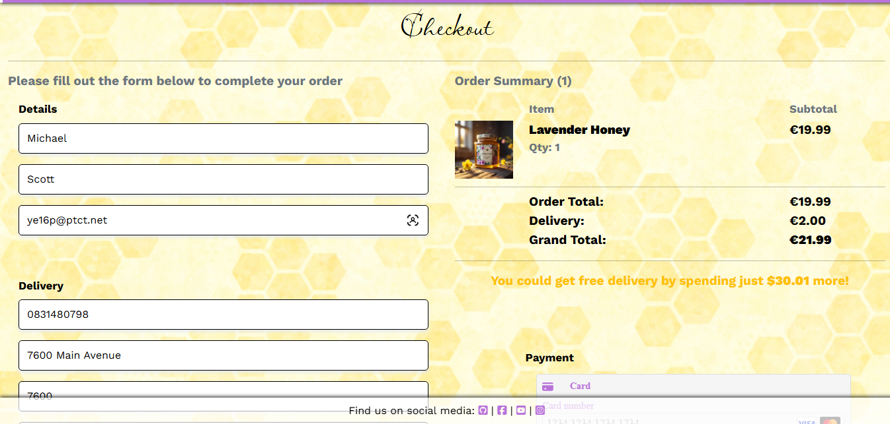
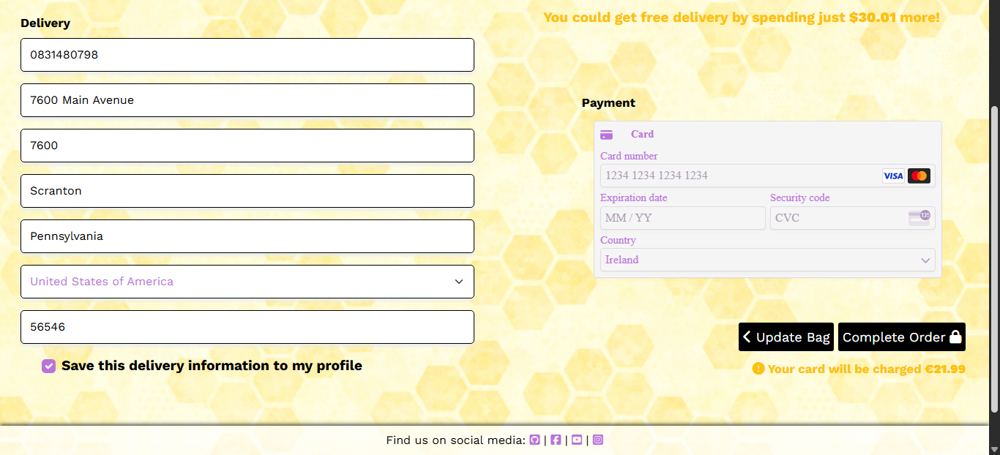

#### Successful Checkout

If the payment is successful, the user is redirected to this page, where they get the full details of their order, including the order summary and their delivery details. They will also receive a confirmation email regarding their order.

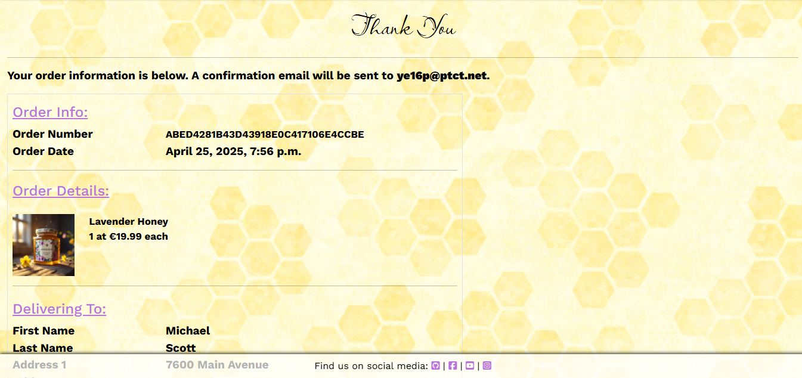

### Blog Posts

In order to raise awareness and to further educate users on the benefits of honey, users can read blog posts relating to the benefits of honey and what it takes to take up beekeeping. 


#### Single Blog Post

Users can click on any blog post and read it:

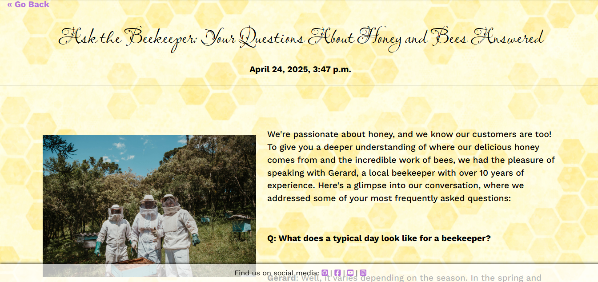

#### Recipes

Another useful section for honey lovers is the Recipes section, where users can explore healthy honey recipes that contain our honey. 

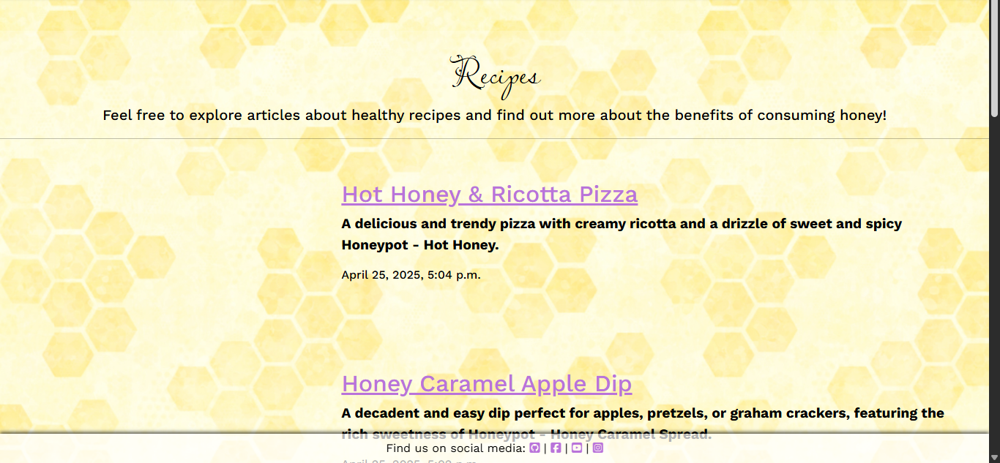
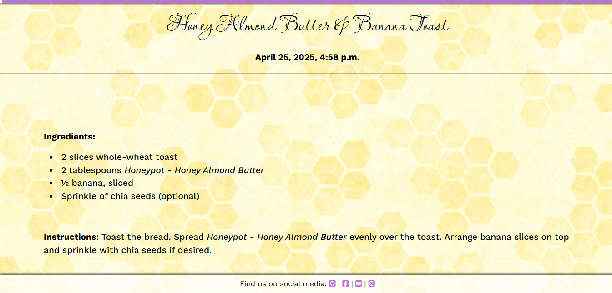

#### Comments

Users that have an account and are logged in can leave comments on any blog post or recipe post. After being submitted, the user is told that their comment is awaiting approval, in the same manner as the reviews of the products. 

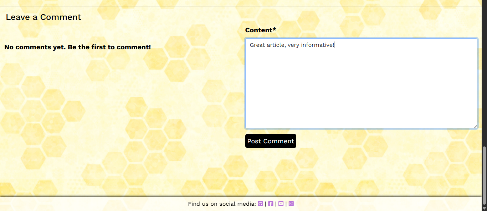

After the comment has been approved by the store owner, users can edit and/or delete their own comments if they want.

### Admin Management

Another important feature of this website is the Admin management, where the Admin (i.e. store owner), can manage the website from one place. Admin can add, edit and delete products, reviews and comments, while they can also view the orders placed across the website and fulfill them.

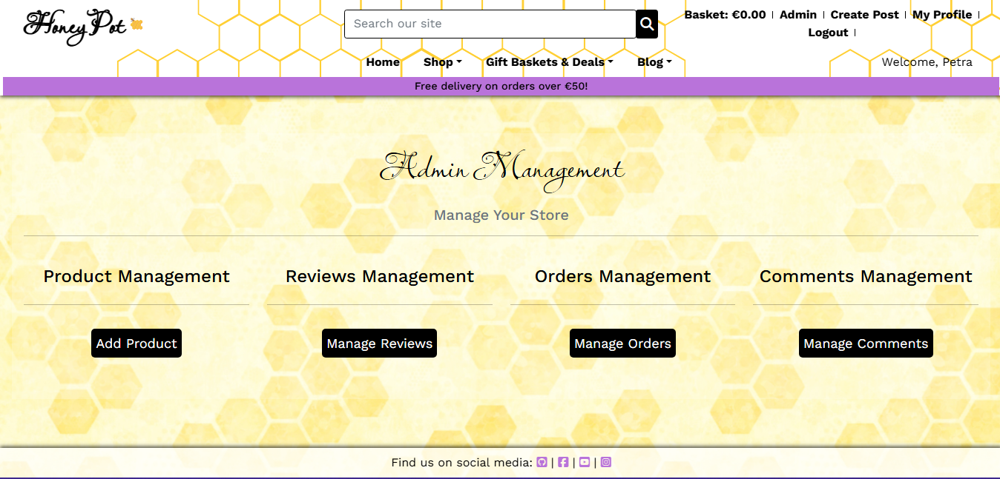

This feature can't be accessed by a regular user. There are no links within the page where they can access it in the first, but even if they write the URL, they're redirected to a 403 error page:

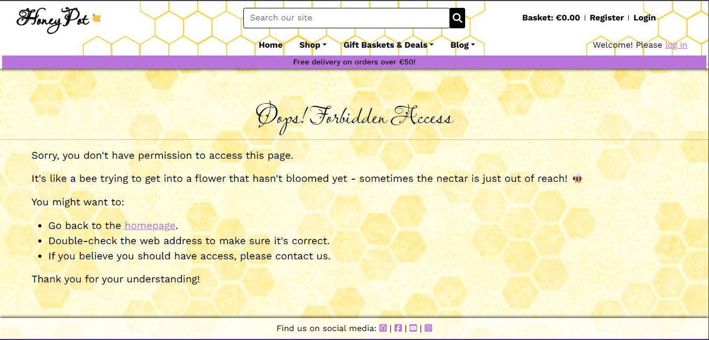

#### Product Management

Admin can add, edit or delete products as they wish:

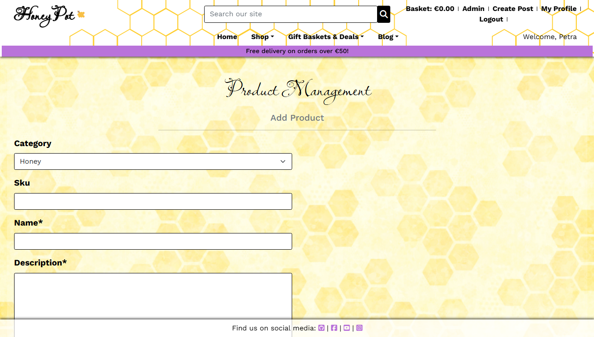
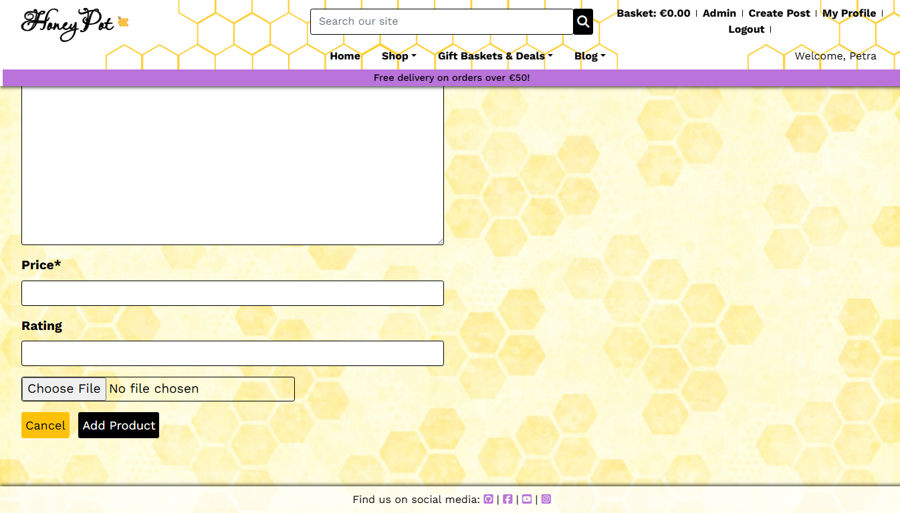

In the products page, store owners can choose to edit or delete their product:


#### Reviews Management

Admin can approve reviews, edit them or delete them entirely:


#### Orders Management

Admin can view orders and fulfill them if they're ready to be dispatched. When Admin clicks on "Mark as Fulfilled", the customer receives an email letting them know that their order is on their way.


#### Comments Management

Admin can approve comments and/or delete them:


## Future Implementations

This website has huge potential to expand upon, and a few future implementations I consider in the future would be:

* *Wishlist* feature, where users can add to wishlist products they'd wish to buy in the future.
* *Testimonials* feature, where users can leave reviews and testimonials regarding the business itself (for now, the testimonials are not implemented, they're read only)
* *Sign In Social Accounts* feature, where users can sign in using their social media accounts, like Facebook, Google or Apple.
* *Generate Sales Reports* feature, where the store owner can generate reports to see which products are the best-selling ones, which aren't performing as well, so that they can push offers on the less popular products to increase sales. This also provides great insight for the store owner.

# Technologies

- **Django**: Web framework for backend development, which provided a structured approach to building this website.
- **PostgreSQL**: Database management system for storing and managing users, products, orders, reviews etc. securely.
- **Amazon AWS**: Cloud-based image and video management service used for handling images of honey products.
- **Stripe API**: API that manages payments and orders.
- **HTML/CSS/JavaScript**: Frontend technologies for creating interactive and responsive user interfaces.
- **Bootstrap**: Frontend framework for designing mobile-first and responsive websites.
- **Git/GitHub**: Version control system and platform for project management.
- **Heroku**: Cloud platform for deploying the application.
- **VSCode**: IDE for coding and developing the project.
- **PEP8**: Python style guide used to ensure code readability and consistency.
- **WAVE Accessibility Tool**: Web accessibility evaluation tool for ensuring accessibility inclusive design practices.
- **W3C Validator**: Tools for validating HTML, CSS, and web standards used in website development.
- **dbdiagram.io**: ERD design.
- **Pexels**: Royalty free images.
- **Balsamiq**: Wireframe building app.
- **ChatGPT**: For generating the blog content and prompts for image generation.
- **LeonardoAI**: Used for generating the product images.

# Deployment and Local Development

## Create a Database

1. Go to [PostgreSQL from Code Institute](https://dbs.ci-dbs.net/).
2. Enter your email address.
3. Click 'Submit' and wait until the database is created.
4. Once you've received a notification that your database has been created, navigate to your email address.
5. Copy the link provided in the email.

## Django Project Settings

6. In the project workspace, create a file named 'Procfile'.
7. Add the following code replacing ```<myproject>``` with the actual project name then save the file:

    ``` python
    web: gunicorn <myproject>.wsgi:application
    ```

8. Generate a secret key for your project - go to [Randon Keygen](https://randomkeygen.com/) and copy any random keys for your project. *Note: Your Secret Key in your Heroku app has to be different from the key in your workspace, so you'll need to generate two different keys for each.*
9. Create a file named `.python-version` and add the Python version that you're using in your workspace, like this: `3.12.9` (or whatever version you're currently using)
10. Now, create a file named 'env.py'. This file contains all of your environment variables like `EMAIL_HOST_USER`, `EMAIL_HOST_PASSWORD` and your `Stripe` keys.
11. Add the following code, replacing ```<myurl>``` with the URL just copied from Code Institute's PostgreSQL and ```<mykey>``` with your generated secret key then save the file:

    ``` python
    import os

    os.environ["DATABASE_URL"]=<myurl>
    os.environ["SECRET_KEY"]=<mykey>
    ```

12. Open 'settings.py' and add the following near the top of the code:

    ```python
    import os
    import dj_database_url
    if os.path.isfile('env.py'):
    import env
    ```

13. Further down the page, replace any current instance of the SECRET_KEY variable with:

    ``` python
    SECRET_KEY = os.environ.get('SECRET_KEY')
    ```

14. Replace the DATABASES variable with

    ```python
    DATABASES = {
    'default': dj_database_url.parse(os.environ.get("DATABASE_URL"))
    }
    ```

15. Save the file then run ```python manage.py migrate``` in the terminal
16. Commit and push these changes to the repository

## Heroku Deployment

17. Log in to **[Heroku](https://www.heroku.com/)** if you already have an account with them. If not, **[create an account](https://signup.heroku.com/)**.
18. Once signed in, click on the "**Create New App**" button located above your dashboard. Give your app a unique name, choose the region you're in (United States/Europe) and click "**Create app**".
19. Before deploying, you need to go to the **Settings** tab. Once there, scroll down and click on **Reveal Config Vars** to open this section.
20. In this section, enter all of your environment variables that are present in your `env.py` file. Fields like:
 * `DATABASE_URL` - Your PostgreSQL database URL that you received in your email
 * `SECRET_KEY` - (*!!! Important: This key has to be a different one from the secret key within your workspace.*)
 * `CLOUDINARY_URL` - *If using Cloudinary*
 * `AWS_ACCESS_ID_KEY` and `AWS_SECRET_ACCESS_KEY` - If using Amazon AWS for storage
 * `EMAIL_HOST_USER` and `EMAIL_HOST_PASSWORD` - If you are planning on sending emails to users (like having a *Reset Password* functionality).
 * `USE_AWS` - Add 'True' to `Value` field
 * `STRIPE_PUBLIC_KEY`, `STRIPE_SECRET_KEY` and `STRIPE_WH_SECRET` - If you're using a payment API like Stripe
21. After that, make sure to go to the **Resources** tab and make sure Heroku didn't automatically set up a database for you. If that happens, simply remove the PostgreSQL database.
22. Now, go to the **Deploy** tab. Once there, in the **Deployment Method** section, click `GitHub` and if needed, authorize `GitHub` to access your `Heroku` account. Click **Connect to GitHub**.
23. Once connected, look up your GitHub repository by entering the name of it under **Search for a repository to connect to** and click **Search**. After you've found your repo, click **Connect**. 
24. Now, you can click on **Enable Automatic Deploys** (optional, but I'd recommend it to save time and to detect any issues should they arise), and then select **Deploy Branch**. *If you enabled automatic deploys, every time you push changes to GitHub, the app will be automatically deployed every time, just like you would with a webpage deployed on GitHub Pages*.
25. The app can take a couple of minutes until it's deployed. Once it's done, you'll see the message **Your app was successfully deployed** and a **View** button will come up where you can see your deployed app. 

## Local Development

### How to Clone
1. Log into your account on GitHub
2. Go to the repository of this project /petra66orii/honeypot/
3. Click on the code button, and copy your preferred clone link
4. Open the terminal in your code editor and change the current working directory to the location you want to use for the cloned directory
5. Type 'git clone' into the terminal, paste the link you copied in Step 3 and press enter

### How to Fork
To fork the repository:
1. Log in (or sign up) to Github.
2. Go to the repository for this project, petra66orii/honeypot
3. Click the Fork button in the top right corner

# Testing

## Validation

### W3C Validator
### Jigsaw CSS Validator
### JS Hint
### PEP8
### Wave Accessibility
### Lighthouse Report

## Manual Testing
## Fixed Bugs

# Credits

## Code Used
## Content

The "No Image Available" placeholder image was taken this [website](https://commons.wikimedia.org/wiki/File:No-Image-Placeholder.svg).

The honey jar images were AI-generated using [Leonardo AI](https://app.leonardo.ai/) and [ChatGPT](https://chatgpt.com).

# Acknowledgements