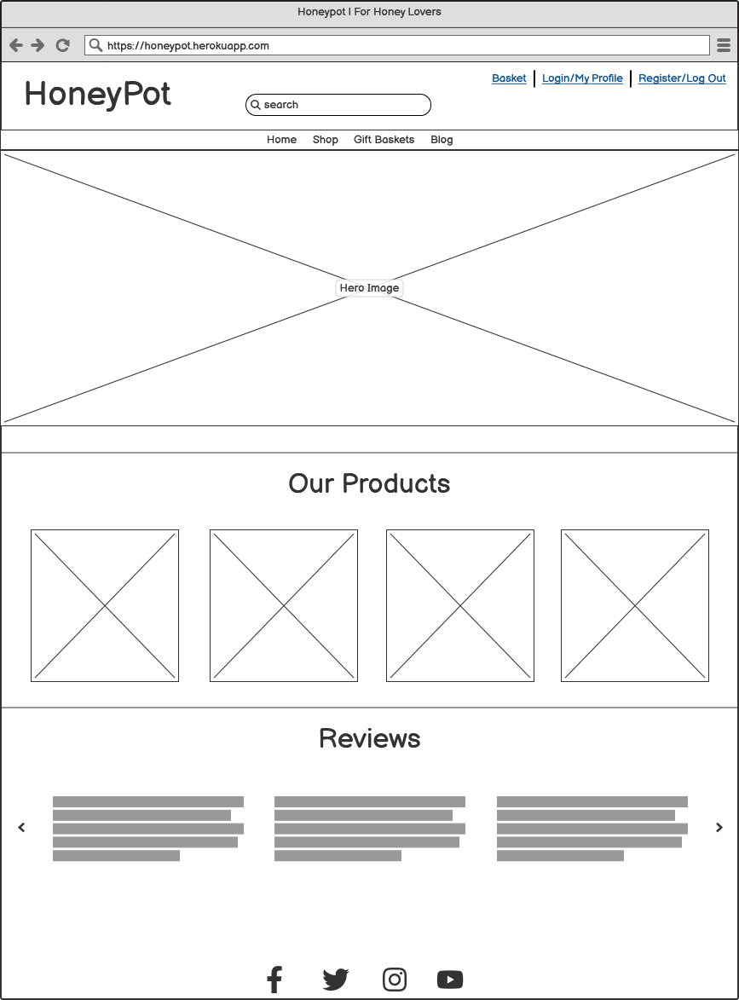
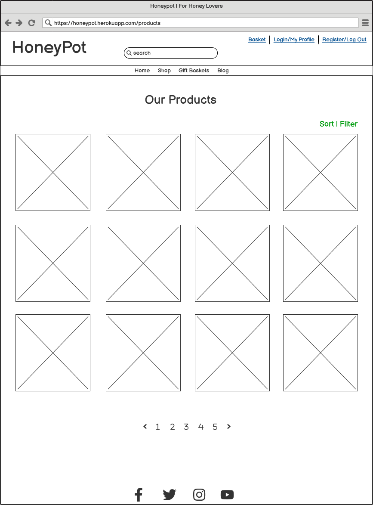
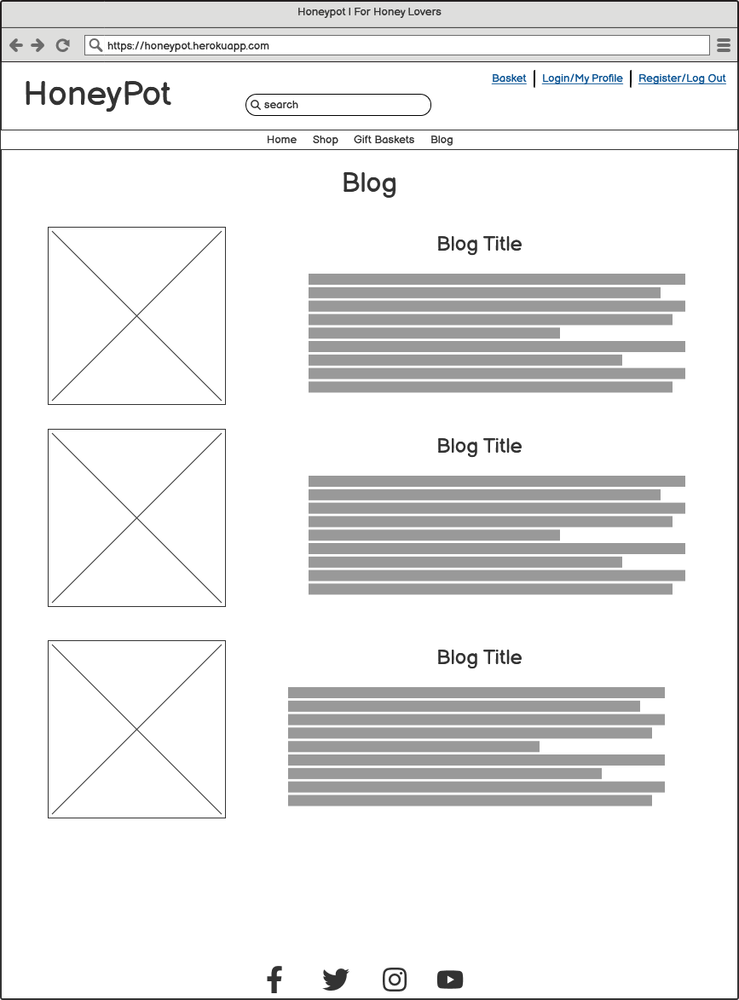

# HoneyPot

HoneyPot is an e-commerce website that specialises in selling honey and honey by-products like beeswax. This website is perfect for people who want to invest into a healthier lifestyle and are looking for raw, unfiltered sweetners like our honey.

# Table of Contents

1. **[Project Goals](#project-goals)**
    * [Workflow](#workflow)
    * [Data Schema](#data-schema)
        + [Product Model](#product-model)
        + [ProductReview Model](#productreview-model)
        + [Category Model](#category-model)
        + [UserProfile Model](#userprofile-model)
        + [Order Model](#order-model)
        + [OrderItem Model](#orderitem-model)
        + [BlogPost Model](#blogpost-model)
        + [Comment Model](#comment-model)
        + [ProductCarousel Model](#productcarousel-model)
        + [Testimonial Model](#testimonial-model)
    * [Business Model](#business-model)
    * [Marketing Strategy](#marketing-strategy)
    * [Facebook Business Page](#facebook-business-page)
2. **[Target Audience](#target-audience)**
3. **[Design](#design)**
    * [The Five Planes of UX](#the-five-planes-of-ux)
        + [1. Strategy](#1-strategy)
        + [2. Scope](#2-scope)
        + [3. Structure](#3-structure)
        + [4. Skeleton](#4-skeleton)
        + [5. Surface](#5-surface)
    * [Wireframes](#wireframes)
        + [Home Page](#home-page)
        + [Product Page](#product-page)
        + [Product Detail Page](#product-detail-page)
        + [Profile Page](#profile-page)
        + [Shopping Bag Page](#shopping-bag-page)
        + [Checkout Page](#checkout-page)
        + [Blog Page](#blog-page)
    * [Typography](#typography)
    * [Color Scheme](#color-scheme)
4. **[Features](#features)**
    * [Existing Features](#existing-features)
        + [Navbar](#navbar)
        + [Home Page](#home-page)
            * [Products Carousel](#products-carousel)
            * [Testimonials](#testimonials)
            * [Newsletter](#newsletter)
        + [User Profile](#user-profile)
            * [My Profile](#my-profile)
            * [Edit Profile](#edit-profile)
            * [Change Password](#change-password)
            * [Delete Account](#delete-account)
        + [User Authentication](#user-authentication)
            * [Sign Up Page](#sign-up-page)
            * [Sign In Page](#sign-in-page)
            * [Reset Password Feature](#reset-password-feature)
        + [Products Page](#products-page)
            * [Product List](#product-list)
            * [Searching & Filtering](#searching--filtering)
            * [Product Details](#product-details)
            * [Reviews & Ratings](#reviews--ratings)
            * [Related Products](#related-products)
        + [Shopping Bag](#shopping-bag)
        + [Checkout](#checkout)
        + [Blog Posts](#blog-posts)
            * [Comments](#comments)
    * [Future Implementations](#future-implementations)
5. **[Technologies](#technologies)**
6. **[Deployment and Local Development](#deployment-and-local-development)**
    * [Create a Database](#create-a-database)
    * [Django Project Settings](#django-project-settings)
    * [Heroku Deployment](#deployment)
    * [Local Development](#local-development)
7. **[Testing](#testing)**
    * [Validation](#validation)
        + [W3C Validator](#w3c-validator)
        + [Jigsaw CSS Validator](#jigsaw-css-validator)
        + [JS Hint](#jshint)
        + [PEP8](#pep8)
        + [Wave Accessibility](#wave-accessibility)
        + [Lighthouse Report](#lighthouse-report)
    * [Manual Testing](#manual-testing)
    * [Fixed Bugs](#fixed-bugs)
8. **[Credits](#credits)**
    * [Code Used](#code-used)
    * [Content](#content)
        + [Icons](#icons)
        + [Images](#images)
9. **[Acknowledgements](#acknowledgements)**

# Project Goals

The main goal for this website is to offer ethically sourced, organic and healthy honey to potential customers, especially in this day and age when a lot of people are trying to be lead healthier lifestyles, but don't always know where to look for it. The website makes it easy for the user to find the product desired, add it to cart and purchase it. It is intuitive to navigate, with a seamless UX, designed in a simple, themed website.

## Workflow

This project was planned using the Agile Methodology. Features were grouped into **EPICS** (*Milestones* on `Github`), which in turn contain **USER STORIES** (*Issues* on `Github`), which also contained *Tasks* and *Acceptance Criteria* to ensure the features were implemented most efficiently.

The project Kanban can be seen [here](https://github.com/users/petra66orii/projects/3)

Users can do the following:

* Browse Products: [EPIC: Product Details](https://github.com/petra66orii/honeypot/milestone/2)
* Review Products: [EPIC: Product Reviews](https://github.com/petra66orii/honeypot/milestone/3)
* Purchase Products: [EPIC: Checkout](https://github.com/petra66orii/honeypot/milestone/5)

## Data Schema

## Data Schema 

Planning for the database involved creating an ERD diagram to see the relationships between the data models:

The application uses a relational database to store and manage data. Below is the data schema:

### Product Model

**Fields**:

* `name`: CharField (max_length=255) - Name of the Product
* `category`: *ForeignKey* to the *Category* model - *Relation*: 
* `price`: DecimalField (max_digits=10) - Price of the product
* `description`: TextField - Description of product
* `sku`: CharField (max_length=100) - Unique indentifier of the product
* `avg_rating`: FloatField (default=0.0) - Average rating of the product
* `image`: ImageField - Picture of the product

### ProductReview Model

**Fields**:

* `user`: *ForeignKey* to the *User* model - *Relation*:
* `product`: *ForeignKey* to the *Product* model - *Relation*:
* `review_text`: TextField - The content of the review
* `rating`: FloatField - Rating of the product

### Category Model

**Fields**:

* `name` = CharField (max_length=100) - Name of the category in the Admin panel
* `friendly_name` = CharField (max_length=100) - Category name displayed in the website
* `has_discount` = BooleanField - Boolean for whether the products in said category are discounted or not
 
### UserProfile Model

**Fields**:

* `user` = *OneToOneField* to the *User* model (*Relation*: One user has one profile)
* `profile_picture` = ImageField - Optional profile picture of the user
* `phone_number` = CharField (max_length=20) - User's phone number
* `street_address1` = CharField (max_length=255) - First line of the address
* `street_address2` = CharField (max_length=255) - Second (optional) line of the address
* `country` = CharField (max_length=100) - User's country of residence
* `county` = CharField (max_length=100) - User's county of residence
* `town` = CharField (max_length=100) - User's town/city of residence
* `postcode` = CharField (max_length=20) - User's postcode

### Order Model

**Fields**:

* `order_number` = CharField (max_length=100) - Unique number order
* `user_profile` = *ForeignKey* to the *UserProfile* model
* `first_name` = CharField (max_length=150) - User's first name
* `last_name` = CharField (max_length=150) - User's last name
* `email` = EmailField - User's email address
* `phone_number` = CharField (max_length=20) - User's phone number
* `address1` = CharField (max_length=255) - First line of the address
* `address2` = CharField (max_length=255) - Second (optional) line of the address
* `country` = CharField (max_length=100) - User's country of residence
* `town` = CharField (max_length=100) - User's town/city of residence
* `county` = CharField (max_length=100) - User's county of residence
* `postcode` = CharField (max_length=20) - User's postcode
* `date` = DateTimeField - Date of purchase
* `delivery_cost` = DecimalField (max_digits=10) - Cost of delivery
* `order_total` = IntegerField - Total number of products ordered
* `total_price` = DecimalField(max_digits=10) - Total price of the order
* `stripe_pid` = CharField (max_length=255) - Unique client secret for Stripe API

### OrderItem Model

**Fields**:

* `order` = *ForeignKey* to the *Order* model
* `product` = *ForeignKey* to the *Product* model
* `quantity` = IntegerField - Quantity of the item bought
* `price_at_purchase` = DecimalField (max_digits=10) - Price paid when item was purchased
* `item_total` = DecimalField (max_digits=10) - Total price of the product

### BlogPost Model

**Fields**:

* `author` = *ForeignKey* to the *User* model
* `title` = CharField (max_length=255) - Title of the blog post
* `slug` = SlugField - Blog post's slug
* `content` = TextField - Content of the post
* `created_on` = DateTimeField - Date of creation
* `updated_on` = DateTimeField - Date of update (if any)
* `status` = CharField (max_length=10) - Whether the post is a draft or published
* `excerpt` = TextField - A short excerpt of the post
* `featured_image` = ImageField - Feautred image (optional)

### Comments Model

**Fields**:

* `blog_post` = *ForeignKey* to the *BlogPost* model
* `user` = *ForeignKey* to the *User* model
* `content` = TextField - Content of comments
* `created_on` = DateTimeField - Date of comment posted
* `updated_on` = DateTimeField - Date of comment updated (if any)

## Business Model

HoneyPot offers high-quality, ethically sourced honey and bee-related products. Its unique selling points include organic, raw, and locally sourced honey, along with infused varieties. Customers enjoy a seamless e-commerce experience with an easy checkout experience and fast shipping. Also, a blog provides valuable content on honey’s benefits, beekeeping, and recipes.

Revenue comes from direct product sales, bundled gift sets, bulk orders for businesses, and affiliate partnerships with influencers in the food, health, and sustainability niches.

Costs include sourcing honey (either from local beekeepers or in-house production), website maintenance, payment processing fees, marketing expenses, and shipping/packaging. Key partnerships involve local suppliers, eco-friendly packaging providers, shipping companies, and content creators who promote the brand.

## Marketing Strategy

The brand focuses on purity, sustainability, and ethical sourcing. A compelling story (such as "Supporting Local Beekeepers" or "Raw & Unfiltered Honey") helps differentiate it. The website has a minimal, clean design with high-quality product images.

SEO and content marketing play a big role, with optimized product pages targeting searches like "raw honey online" and "best organic honey." The blog covers topics like honey’s health benefits, DIY recipes, and beekeeping sustainability. Video content (shorts, reels) showcases tutorials and product highlights.

Social media efforts focus on Instagram and Pinterest for aesthetic product photography, TikTok and YouTube Shorts for quick recipes, and partnerships with food bloggers and wellness influencers. Giveaways help boost engagement.

Email marketing includes newsletters with exclusive discounts, first-time purchase incentives, and a loyalty program rewarding repeat buyers. Paid ads on Google and social media target keywords and retarget visitors who abandoned their shopping carts.

## Facebook Business Page

The Facebook page is optimized with a high-quality logo, engaging cover image, and a compelling About section. A Shop Now button links to the website, and Messenger is set up for customer inquiries.

Content includes educational posts on honey’s benefits, product highlights, behind-the-scenes production stories, customer testimonials, live Q&As, and seasonal promotions. The brand engages with relevant Facebook groups and creates a community where customers share recipes and reviews.

# Target Audience

HoneyPot sells raw, unfiltered honey infused with different ingredients (whilst also selling the *classical* honey) at a more affordable price than most honey retailers. Our target audience is large, addressing to people looking for organic products, young families that want to offer their children healthy desserts, people that want a healthier lifestyle, or that just want to replace sugar.

# Design

## The Five Planes of UX

The five planes of UX — *Strategy*, *Scope*, *Structure*, *Skeleton*, and *Surface* — offer a structured approach to crafting a seamless and engaging user experience. These principles shape the design of the e-commerce honey website.

### 1. Strategy

The website’s purpose is to provide customers with high-quality honey and bee-related products while fostering brand trust and educating users about honey’s benefits.

**User Needs**:

* A seamless shopping experience with clear product categories and easy checkout.
* Informative content about honey, including health benefits, sustainability, and recipes.
* Customer reviews and ratings to help with purchasing decisions.

**Business Goals**:

* Increase product sales through a well-optimized and conversion-driven design.
* Build a strong brand identity and customer loyalty with engaging content and a smooth shopping experience.
* Differentiate from competitors by emphasizing sustainability, ethical sourcing, and product quality.

### 2. Scope

The website includes key e-commerce and content-driven features:

**Product Catalog & Shopping Experience**:

* Browse products by category, type, and price range.
* Add items to cart and complete a secure checkout using Stripe.
* View product descriptions, ingredients, and customer reviews.

**User Engagement & Content**:

* *Blog*: Articles on honey’s benefits, recipes, and sustainable beekeeping.
* *Product Reviews*: Customers can leave ratings and feedback to guide other buyers.
* *Email Newsletter*: Users can sign up for updates, promotions, and exclusive offers.

**Marketing & Retention**:

* Discount codes and promotional offers.
* Loyalty rewards for repeat customers.
* Social media integration for sharing and engagement.

### 3. Structure

**Content Hierarchy**:

* *Primary Navigation*: Home, Shop, Blog, About Us, Contact.
* *Secondary Navigation*: Account, Cart, Order History, FAQs.

**User Flows**:

*For purchasing a product*:

* Browse products by category or use filters.
* Select an item, read the description and reviews.
* Add to cart and proceed to checkout.
* Enter payment and shipping details, complete the order.
* Receive confirmation and tracking updates.

*For reading the blog*:

* Browse articles by category (e.g., health benefits, recipes).
* Read content and explore related posts.
* Share or comment on blog posts.

### 4. Skeleton

**Navigation Design**:

* A fixed top navigation bar with dropdown menus for quick access.
* A search bar for finding products and blog content easily.

**Interface Elements**:

* *Forms*: Simple, clean checkout and review submission forms.
* *Product Cards*: Feature images, price, rating, and a quick “Add to Cart” button.
* *Call-to-Action (CTA) Buttons*: Prominent "Buy Now," "Read More," and "Subscribe" buttons.

**Feedback & Progress Indicators**:

* Visual confirmation for actions like “Item added to cart” or “Order placed.”
* Checkout progress bar to guide users through the purchase process.

**Responsive Design**:

* Mobile-first approach to ensure smooth shopping on all devices.

### 5. Surface

**Design Style**:

* *Theme*: A warm, natural aesthetic that reflects purity and sustainability.
* High-quality images of honey, bees, and nature to enhance visual appeal.

**Typography**:

* A clean, modern sans-serif font for readability, paired with a handwritten or organic-style font for branding elements.

**Imagery & Emotional Impact**:

* High-resolution product images showcasing texture and packaging details.
* Lifestyle shots of honey being used in recipes or natural settings to reinforce authenticity.
* Creates a sense of warmth, tradition, and natural goodness, encouraging users to connect with the brand and its values.

## Wireframes

For establishing the UX design, wireframes were designed using Balsamiq:

### Home Page

### Product Page

### Product Detail Page

### Profile Page

### Shopping Bag Page

### Checkout Page

### Blog Page

## Typography

For the logo I went for the *"Lavishly Yours"* font, because it inspired elegance to me and it felt like an appropriate font for a compelling logo. 

For the rest of the website I used *"Work Sans"* for its readablity.

## Color Scheme

Since it's an e-commerce website that sells honey, the color scheme is fairly simple, containing black and white to keep it classic, and added yellow-gold - to match the honey, and lavender - for a pop of color, in order to bring a nice aesthethic to the website.

# Features

## Existing Features

### Navbar
### Home Page
### User Profile
### User Authentication

#### Sign Up Page
#### Sign In Page
#### Reset Password Feature

### Blog Posts

#### Comments

## Future Implementations

# Technologies

# Deployment and Local Development

## Deployment

1. Log in to **[Heroku](https://www.heroku.com/)** if you already have an account with them. If not, **[create an account](https://signup.heroku.com/)**.
2. Once signed in, click on the "**Create New App**" button located above your dashboard. Give your app a unique name, choose the region you're in (United States/Europe) and click "**Create app**".
3. Before deploying, you need to go to the **Settings** tab. Once there, scroll down and click on **Reveal Config Vars** to open this section.
4. In this section, enter all of your environment variables that are present in your `env.py` file. Fields like `DATABASE_URL`, `SECRET_KEY`, `CLOUDINARY_URL` (*if using Cloudinary*), or `AWS_ACCESS_ID_KEY` and `AWS_SECRET_ACCESS_KEY` if using Amazon AWS for storage, `EMAIL_HOST_USER` and `EMAIL_HOST_PASSWORD` if you are planning on sending emails to users (like having a *Reset Password* functionality).
5. After that, make sure to go to the **Resources** tab and make sure Heroku didn't automatically set up a database for you. If that happens, simply remove the PostgreSQL database.
6. Now, go to the **Deploy** tab. Once there, in the **Deployment Method** section, click `GitHub` and if needed, authorize `GitHub` to access your `Heroku` account. Click **Connect to GitHub**.
7. Once connected, look up your GitHub repository by entering the name of it under **Search for a repository to connect to** and click **Search**. After you've found your repo, click **Connect**. 
8. Now, you can click on **Enable Automatic Deploys** (optional, but I'd recommend it to save time and to detect any issues should they arise), and then select **Deploy Branch**. *If you enabled automatic deploys, every time you push changes to GitHub, the app will be automatically deployed every time, just like you would with a webpage deployed on GitHub Pages*.
9. The app can take a couple of minutes until it's deployed. Once it's done, you'll see the message **Your app was successfully deployed** and a **View** button will come up where you can see your deployed app. 

## Local Development

### How to Clone
1. Log into your account on GitHub
2. Go to the repository of this project /petra66orii/honeypot/
3. Click on the code button, and copy your preferred clone link
4. Open the terminal in your code editor and change the current working directory to the location you want to use for the cloned directory
5. Type 'git clone' into the terminal, paste the link you copied in Step 3 and press enter

### How to Fork
To fork the repository:
1. Log in (or sign up) to Github.
2. Go to the repository for this project, petra66orii/honeypot
3. Click the Fork button in the top right corner

# Testing

## Validation

### W3C Validator
### Jigsaw CSS Validator
### JS Hint
### PEP8
### Wave Accessibility
### Lighthouse Report

## Manual Testing
## Fixed Bugs

# Credits

## Code Used
## Content

The "No Image Available" placeholder image was taken this [website](https://commons.wikimedia.org/wiki/File:No-Image-Placeholder.svg).

The honey jar images were AI-generated using [Leonardo AI](https://app.leonardo.ai/) and [ChatGPT](https://chatgpt.com).

# Acknowledgements